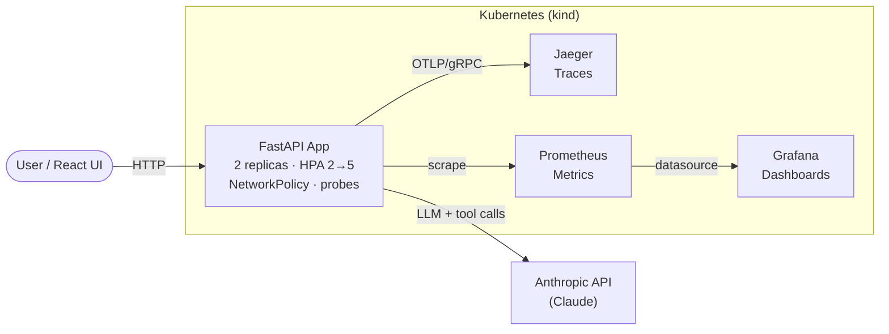

# Agent Platform

A self-hosted platform for running and observing Claude-powered AI agents. Built with FastAPI, deployed on Kubernetes via Helm, with full observability through OpenTelemetry, Jaeger, Prometheus, and Grafana.

## What this demonstrates

This project is a portfolio demonstration of production-grade platform engineering applied to an agentic AI workload.

**Infrastructure ownership**
- Kubernetes deployment via Helm with HPA (2→5 replicas), NetworkPolicy (default-deny), resource limits, and liveness/readiness probes
- One-command cluster provisioning and deployment via `deploy.sh` using kind
- IaC-first approach — all config in code, nothing applied manually

**Agentic AI platform design**
- Multi-turn Claude agent loop with native tool use (code execution, file I/O, web search stub)
- Every agent step — LLM calls, tool invocations, token usage — captured as OpenTelemetry spans
- Async session execution with background task queue; API returns immediately with session ID

**Observability**
- Distributed tracing: session → LLM call → tool call spans visible in Jaeger
- Prometheus metrics: session counters, tool call rates, p95 duration histograms, active session gauge
- Grafana dashboard provisioned as code via Helm values

**CI/CD**
- Three GitHub Actions workflows: Python + frontend lint/typecheck, Docker build + Trivy security scan (blocks on CRITICAL/HIGH), Helm lint + dry-run validation on every PR

## Screenshots

**Agent running — live tool call inspector**


**Agent completed — tool call input/output + result**


**Jaeger — distributed trace waterfall (session → llm_call → tool_call spans)**


**Grafana — sessions, tool call rates, p95 duration, completion rate**


## Architecture



**Stack:** FastAPI · Anthropic Claude SDK · React · Vite · TypeScript · OpenTelemetry · Jaeger · Prometheus · Grafana · Docker · Kubernetes (kind) · Helm

## Features

- **React UI** — session list with status indicators, task input, tool call inspector, live polling while agent runs
- **Agent sessions** — submit a task, get back a session ID; agent runs asynchronously with full tool-use support
- **Distributed tracing** — every request and agent turn traced via OTLP → Jaeger
- **Prometheus metrics** — sessions created counter exposed at `/metrics`
- **Kubernetes-native** — Helm chart with HPA, NetworkPolicy, resource limits, liveness/readiness probes
- **One-command deploy** — `./deploy.sh` creates the kind cluster, builds the image, and installs the Helm release
- **CI/CD** — GitHub Actions for lint/test, Docker build + Trivy security scan, and Helm dry-run validation

## API

| Method | Path | Description |
|--------|------|-------------|
| `POST` | `/api/v1/sessions` | Create and run an agent session |
| `GET` | `/api/v1/sessions` | List all sessions |
| `GET` | `/api/v1/sessions/{id}` | Get session by ID |
| `DELETE` | `/api/v1/sessions/{id}` | Delete a session |
| `GET` | `/health` | Liveness check |
| `GET` | `/metrics` | Prometheus metrics |

### Example

```bash
# Create a session
curl -X POST http://localhost:8000/api/v1/sessions \
  -H "Content-Type: application/json" \
  -d '{"task": "What is the current date and summarise the last 3 months of AI news?"}'

# Poll for result
curl http://localhost:8000/api/v1/sessions/<session_id>
```

## Local Development

### Prerequisites

- Python 3.11+
- Docker + Docker Compose

### Setup

```bash
cp .env.example .env
# Add your ANTHROPIC_API_KEY to .env

python -m venv venv && source venv/bin/activate
pip install -r requirements.txt
uvicorn app.main:app --reload
```

### Frontend (React UI)

```bash
cd frontend
npm install
npm run dev   # http://localhost:5173 — proxies /api to port 8000
```

### Docker Compose (full stack)

```bash
docker compose up --build
```

This starts the API alongside Jaeger, Prometheus, and Grafana.

| Service | URL |
|---------|-----|
| API | http://localhost:8000 |
| Jaeger UI | http://localhost:16686 |
| Prometheus | http://localhost:9090 |
| Grafana | http://localhost:3000 |

## Kubernetes Deployment

### Prerequisites

- [kind](https://kind.sigs.k8s.io/) · [kubectl](https://kubernetes.io/docs/tasks/tools/) · [helm](https://helm.sh/) · Docker

### Deploy

```bash
export ANTHROPIC_API_KEY=<your_key>
chmod +x deploy.sh
./deploy.sh
```

The script will:
1. Create a local kind cluster with port mappings
2. Build and load the Docker image into the cluster
3. Apply the `agent-platform` namespace
4. Run `helm dependency update` + `helm upgrade --install`

### Helm chart

```
charts/agent-platform/
├── Chart.yaml          # chart metadata, Prometheus + Grafana as dependencies
├── values.yaml         # all defaults (override with --set or -f)
└── templates/
    ├── deployment.yaml     # 2 replicas, probes, resource limits
    ├── service.yaml        # NodePort
    ├── hpa.yaml            # scale 2→5 on CPU 70% / memory 80%
    ├── networkpolicy.yaml  # ingress :8000, egress DNS + OTLP + HTTPS
    ├── secret.yaml         # ANTHROPIC_API_KEY
    └── jaeger.yaml         # Jaeger all-in-one
```

**Custom values:**

```bash
helm upgrade --install agent-platform charts/agent-platform \
  -n agent-platform \
  --set anthropicApiKey=$ANTHROPIC_API_KEY \
  --set replicaCount=3 \
  --set autoscaling.maxReplicas=10
```

### Observability endpoints (Kubernetes)

| Service | URL |
|---------|-----|
| API | http://localhost:8000 |
| Jaeger UI | http://localhost:16686 |
| Prometheus | http://localhost:9090 |
| Grafana | http://localhost:3000 (admin / admin123) |

## Project Structure

```
agent-platform/
├── app/
│   ├── api/routes.py           # FastAPI routes
│   ├── agent/
│   │   ├── models.py           # AgentSession pydantic model
│   │   ├── runner.py           # Claude agent execution loop
│   │   └── store.py            # In-memory session store
│   ├── observability/
│   │   ├── tracing.py          # OTLP tracing setup
│   │   └── metrics.py          # Prometheus metrics
│   └── main.py                 # App entrypoint
├── frontend/                   # React + Vite + TypeScript UI
│   └── src/
│       ├── api.ts              # Fetch wrappers
│       ├── types.ts            # AgentSession, ToolCall types
│       ├── hooks/              # useSessions, useSession (polling)
│       └── components/         # SessionList, SessionDetail, StatusBadge, NewSessionForm
├── .github/workflows/
│   ├── ci.yml                  # Python lint/test + frontend lint + typecheck
│   ├── docker.yml              # Docker build + Trivy CRITICAL/HIGH scan
│   └── helm.yml                # Helm lint + template dry-run + kubeval
├── charts/agent-platform/      # Helm chart
├── k8s/manifests/              # Raw Kubernetes manifests
├── kind-config.yaml            # kind cluster definition
├── docker-compose.yml          # Local full-stack compose
├── Dockerfile
├── deploy.sh                   # One-shot k8s deploy script
└── requirements.txt
```

## Environment Variables

| Variable | Default | Description |
|----------|---------|-------------|
| `ANTHROPIC_API_KEY` | — | **Required.** Anthropic API key |
| `ENVIRONMENT` | `development` | Deployment environment tag |
| `OTLP_ENDPOINT` | `http://jaeger:4317` | OpenTelemetry collector endpoint |
| `MAX_TOKENS` | `4096` | Max tokens per agent turn |
