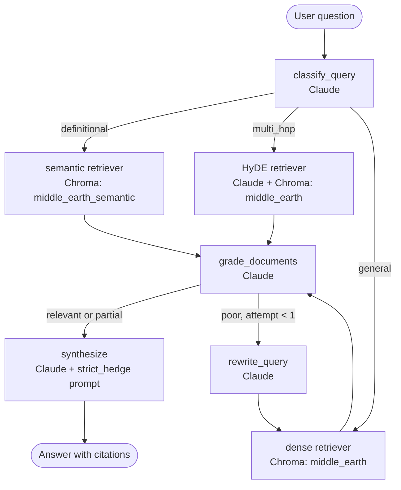
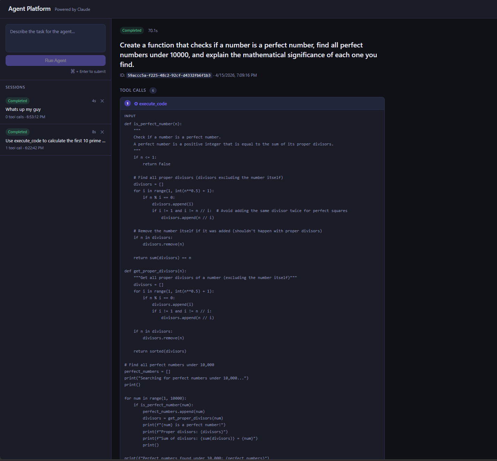
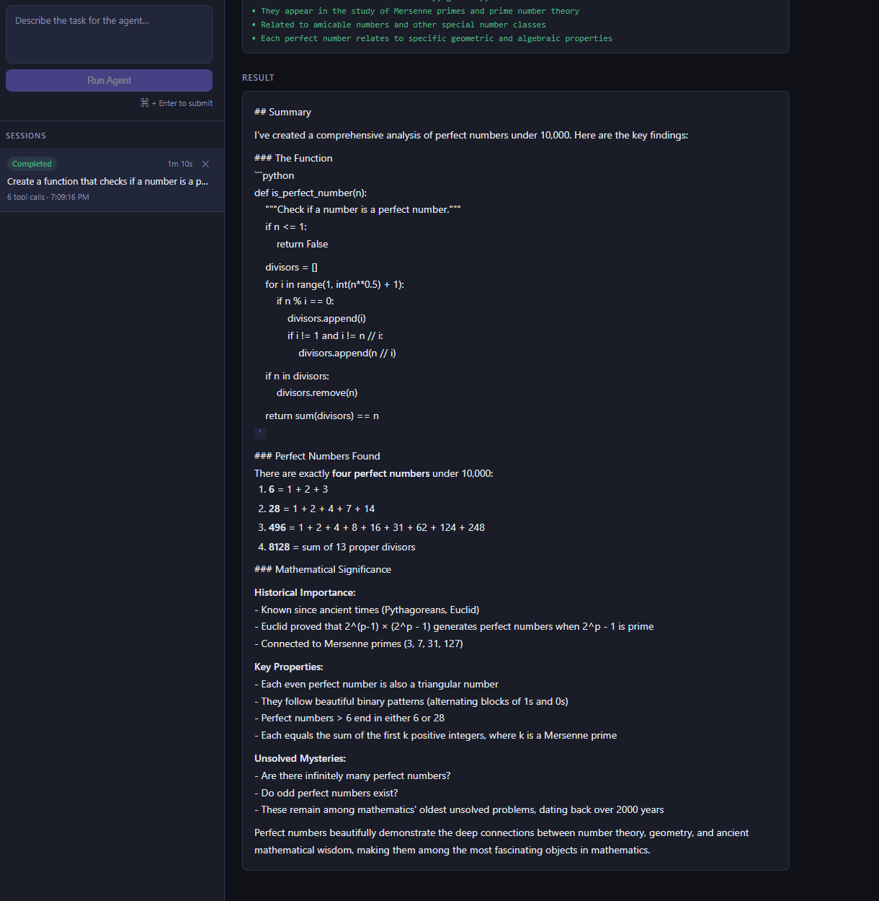
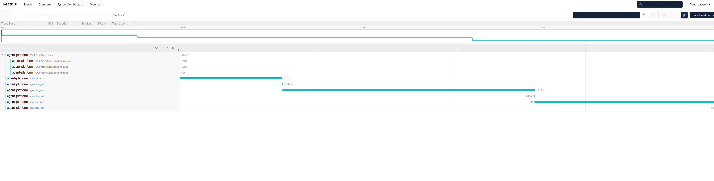
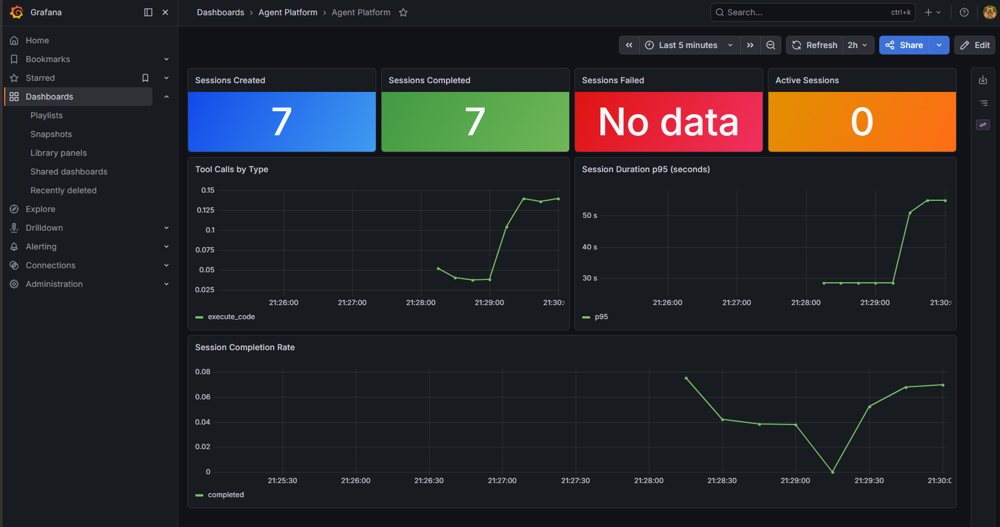
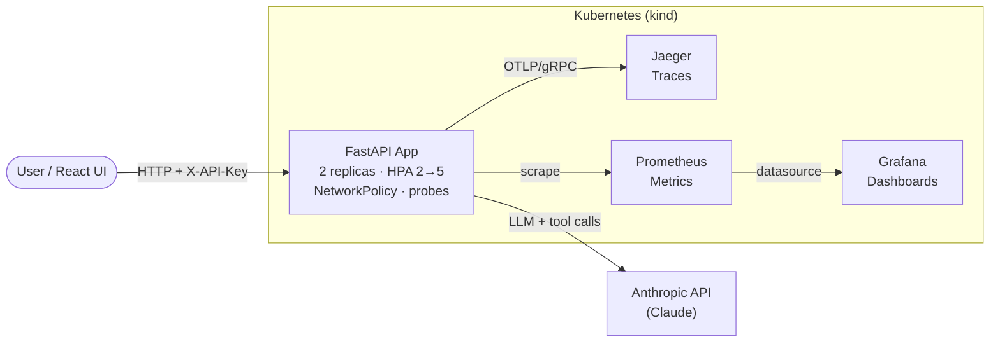

# Agent Platform

A self-hosted Claude-powered platform with two halves that share one FastAPI service:

1. **Measured Agentic RAG** (`app/rag/`): a Middle-earth lore RAG with a LangGraph routing agent. Each query is classified and dispatched to the retriever measured to perform best on that question shape (semantic for definitional, HyDE for multi-hop, dense for general), graded for relevance, and optionally retried. Every routing and retrieval choice is backed by RAGAS scores.
2. **Production platform** (`app/agent/`, `app/tools/`, `app/observability/`, `helm/`, `k8s/`, `.github/`): the original multi-turn Claude tool-use agent with OpenTelemetry tracing, Prometheus metrics, Grafana dashboards, Kubernetes deployment via Helm, and a React UI.

The RAG service is exposed alongside the agent on the same API: `POST /api/v1/rag/query` (single retriever) and `POST /api/v1/rag/agent_query` (routing agent).

## Architecture


## Measured Agentic RAG

### Headline result

RAGAS scores over 7 in-corpus probes, k=4, judge = Claude `claude-sonnet-4-5`, single-run (judge noise on faithfulness/relevancy is ~0.04 run-to-run; context metrics are deterministic given fixed retrieval).

| retriever | faithfulness | answer_relevancy | ctx_precision | ctx_recall |
|---|---:|---:|---:|---:|
| dense (baseline) | 0.949 | 0.801 | **0.881** | 0.821 |
| sparse (BM25)    | 0.832 | 0.691 |   0.440   | 0.179 |
| hyde             | 0.928 | 0.812 | **0.937** | 0.821 |
| multi_query      | 0.900 | 0.809 |   0.881   | 0.821 |
| pdr              | 0.958 | 0.840 |   0.873   | 0.595 |
| semantic         | **0.988** | 0.842 | 0.758 | 0.833 |
| agent (routing)  | 0.918 | 0.812 | 0.889 | **0.881** |

Per-route observations:

- HyDE is the one query transform that beats dense on a deterministic metric: +0.056 on context_precision. It cleanly recovers the Smaug/Lake-town chunk dense never reached, at the cost of a +1 LLM call per query (~6s).
- Semantic chunking is the one chunk-granularity intervention that lifts recall (0.821 to 0.833), specifically fixing the two worst dense probes (Mithril 0.33 to 1.0, Bombadil 0.67 to 1.0). It pays for that with precision (0.881 to 0.758).
- Multi-query is indistinguishable from dense once the variant union is re-ranked by similarity to the original query. Pays an LLM cost for no measurable gain on this corpus.
- Parent-document retrieval regressed recall (0.595): dedup-by-parent diversifies away from articles where ground-truth facts are concentrated.
- Sparse (BM25 with custom preprocessor) loses every metric. Brittle on this corpus.
- **Agent (routing) wins recall outright (0.881)** by composing the recall wins of multiple retrievers per probe: Mithril and Bombadil go to 1.0 (semantic's territory), Smaug and Battle of Five Armies go to 1.0 (dense's territory). No single retriever beats 0.833; routing breaks the ceiling. The cost is faithfulness (0.918 vs semantic's 0.988): when the agent retries on a poor grade, the rewrite + second retrieval injects mildly noisier context and the synthesizer makes more claims the judge cannot fully entail. The latency budget already flagged the routing agent at ~14s end-to-end (cold), so this is a quality-vs-speed-vs-cost three-way tradeoff, not a free win.

### What the agent does

The routing agent (`app/rag/agent/graph.py`) is a LangGraph state machine. Each query is classified into one of three routes, retrieved via the route-specific retriever, graded for relevance, optionally rewritten and retried (budget: 1), then synthesized into a cited answer.


```mermaid
flowchart TD
    Q([User question])
    C[classify_query<br/>Claude]
    Sem[semantic retriever<br/>Chroma: middle_earth_semantic]
    Hy[HyDE retriever<br/>Claude + Chroma: middle_earth]
    De[dense retriever<br/>Chroma: middle_earth]
    G[grade_documents<br/>Claude]
    RW[rewrite_query<br/>Claude]
    Syn[synthesize<br/>Claude + strict_hedge prompt]
    A([Answer with citations])

    Q --> C
    C -->|definitional| Sem
    C -->|multi_hop| Hy
    C -->|general| De
    Sem --> G
    Hy --> G
    De --> G
    G -->|relevant or partial| Syn
    G -->|poor, attempt &lt; 1| RW
    RW --> De
    Syn --> A
```

Indices (all gitignored, rebuilt from `data/raw/` via `app/rag/ingestion/`):

- `data/chroma_middle_earth/`: 2,296 articles, 14,996 recursive chunks (800/120), `text-embedding-3-small`. Used by dense and HyDE.
- `data/chroma_semantic/`: same corpus, 6,544 chunks split at embedding-distance topic boundaries via `SemanticChunker`. Used by the semantic route.
- `data/chroma_pdr/` + `data/pdr_parents.pkl`: 6,031 parents (2000-char recursive) and 31,669 children (400-char) for parent-document retrieval. Not on the routing path; available as `kind=pdr` for A/B.
- Sources: Fandom LotR wiki (631 articles, scraped via `action=parse` + BeautifulSoup since Fandom lacks the TextExtracts extension), Wikipedia Middle-earth categories (51 articles, scraped in two passes via `prop=extracts`), Tolkien Gateway (1,614 articles, scraped after the original block on TG's endpoint lifted; `prop=extracts`). Each chunk's metadata carries a `source` field so the agent can attribute and the eval can filter.

Classifier accuracy was measured separately: **6 of 7 probes routed as pre-registered**; the one apparent miss (Beren & Lúthien) is the pre-registered expectation being wrong, not the classifier (the classifier's reasoning matched the alternative hypothesis written in the same session).

### Methodology and judgment

The repo's substance lives in [`app/rag/eval/findings.md`](app/rag/eval/findings.md), which carries detailed notes for every intervention with deltas, regressions, falsified hypotheses, and the failure-mode taxonomy that drove the routing design:

- `synthesis-recovered`: retrieval looked imperfect but the LLM bridged the gap (Smaug, Beren).
- `candidate-set-miss-fixable`: dense missed the right document, hybrid or HyDE found it (Smaug, Mithril at the retrieval layer).
- `candidate-set-miss-corpus-gap`: no retriever could find it because the document was absent (Bombadil initially, closed by a later corpus add).
- `hybrid-regressed`: hybrid hurt a query dense already solved (Gandalf, Battle).
- `dense-already-optimal`: nothing measurably helped (Mithril at the answer layer, Gandalf).

Methodology details worth flagging:

- **Pre-registration.** Route categorizations and outcome predictions were written before each measurement. On one probe the classifier appeared to "miss" Beren & Lúthien; checking the pre-registered prediction reclassified the miss as a hit against the plan's later hypothesis.
- **Variance bands.** RAGAS context metrics are deterministic; faithfulness and answer_relevancy carry ~0.04 judge variance per run. `app/rag/eval/compare_to_baseline.py` flags deltas only when they exceed `max(0.02, 2 * baseline_std)`.
- **Falsified hypotheses are kept in the record.** The early "BM25 will rescue Tom Bombadil" thesis was falsified twice (first by a corpus gap, then by the measurement after the gap was closed). Both falsifications are in findings.md verbatim.

### Latency budget

End-to-end agent latency was measured per-node via a `@timed` decorator (`app/rag/eval/measure_latency.py`). One full agent invocation, cold, k=4:

| node | mean ms | notes |
|---|---:|---|
| classify | ~2500 | Claude call, small prompt |
| retrieve (dense) | ~260 | OpenAI embed + Chroma similarity |
| retrieve (semantic) | ~1000 | same path, slightly larger chunks |
| retrieve (hyde) | ~6100 | adds a hypothetical-generation Claude call |
| grade | ~3000 | Claude call, ~2KB prompt |
| synthesize | ~7000 | Claude call, ~1KB output |
| **total** | **~14000** | end-to-end per query, cold |

`@lru_cache(256)` on `(question, route, k)` makes warm-pass retrieval cost zero. Worth ~5-6s on HyDE-routed probes (Smaug 14.8 to 9.8 seconds); negligible on dense routes (already 260ms). Semantic-similarity caching is deferred (exact-string LRU catches every demo-loop hit and avoids the silent-wrong-answer mode of fuzzy-match caches; worth revisiting under production traffic).

### Streaming endpoint

A parallel async path at `POST /api/v1/rag/agent_query_stream` returns Server-Sent Events: a single `metadata` frame (route, grade, trace, sources) emitted before the LLM starts streaming, then `token` frames yielded as Claude generates, then `answer_complete` (full text for downstream consumers), then `done`. Total end-to-end latency is unchanged (~14s cold) but time-to-first-byte drops to ~5s (classify + retrieve + grade), and the UI gets the route + sources at t=0 to fill the synthesize gap.

Implementation lives in `app/rag/agent/graph_streaming.py`: async versions of the four orchestration nodes (`aclassify_query`, `aretrieve`, `agrade_documents`, `arewrite_query`) plus `synthesize_streaming` as an async generator that runs *outside* the compiled graph (graphs return state, not streams). The non-streaming `build_agent()` / `/agent_query` / `/agent_query_debug` paths are preserved byte-identical so RAGAS, the probe sweep, and any A/B caller continue to work.

```bash
curl -N -X POST localhost:8000/api/v1/rag/agent_query_stream \
  -H 'content-type: application/json' \
  -d '{"question":"Who killed Smaug?"}'
```

### Multi-turn (memory + coref)

`POST /api/v1/rag/agent_query_stream_v2` accepts an optional `session_id`. When present, the endpoint loads the last 6 conversation turns from a SQLite store (`data/conversations.db`, path overridable via `CONV_DB_PATH`), runs a coreference-resolve node at the front of the graph to rewrite the question into a self-contained form, then synthesises with the history threaded into the prompt. The synthesis prompt carries one extra rule for the multi-turn case: prior turns establish what was *discussed*, not what is *true*, so factual claims still have to come from the retrieved context, not from earlier assistant answers.

Three details worth knowing:
- The coref rewriter is instructed to return the question VERBATIM if it is already self-contained. The smoke test confirms this guard: `"What is mithril?"` comes back unchanged, not paraphrased.
- The user's turn is persisted *before* the LLM runs (so mid-stream errors do not lose it); the assistant's turn is persisted only after `answer_complete`. A half-streamed answer is not safe to save.
- `DELETE /api/v1/rag/sessions/{session_id}` clears a conversation.

Smoke example (pronoun chain that resolves Smaug → Bard → weapon):

```bash
SID=demo-$(date +%s)
for q in "Who is Smaug?" "Who killed him?" "With what weapon?"; do
  curl -N -X POST localhost:8000/api/v1/rag/agent_query_stream_v2 \
    -H 'content-type: application/json' \
    -d "{\"session_id\":\"$SID\",\"question\":\"$q\"}"
done
```

In the smoke run: turn 2 (`Who killed him?`) resolves to `Who killed Smaug?` and the classifier flips the route from `definitional` to `multi_hop`, which routes to HyDE (the measured winner for this question shape). Memory + routing-by-question-type compose: the pronoun resolution is what makes the route flip even possible.

### Semantic cache (opt-in)

`app/rag/cache/semantic.py` ships a semantic response cache wired into `/agent_query`. Disabled by default. Enable with `SEMANTIC_CACHE_ENABLED=1`. Configurable via `SEMANTIC_CACHE_THRESHOLD` (default 0.97) and `SEMANTIC_CACHE_MAX_SIZE` (default 256). The cache embeds each question with `text-embedding-3-small`, compares to prior cached questions by cosine similarity, and serves the cached `QueryResponse` (with `from_cache=true` and the similarity score visible to the client) on hits.

Smoke test (enabled, 0.97 threshold):

| call | latency | from_cache | similarity |
|---|---|---|---|
| `Who killed Smaug?` (cold) | 17.1s | false | n/a |
| `Who killed Smaug?` (repeat) | **0.2s** | **true** | 0.9999 |
| `Who slayed Smaug the dragon?` | 16.5s | false | (paraphrase missed at 0.97) |

Three things this lever is honest about: (a) the threshold is a guess, not tuned against a paraphrase probe set; (b) the cache has no automatic invalidation, so changing the prompt or re-ingesting the corpus while the process keeps running serves stale entries until restart; (c) it is wired into `/agent_query` only, not the streaming or multi-turn endpoints (streaming would require serving a cached response as a single fake "token frame"; multi-turn breaks because the cache key is the raw question, ignoring conversation context that changes meaning). The disabled-by-default posture is deliberate: the lever exists for portfolio visibility, but on this 7-probe corpus the exact-string LRU on retrieval already catches every repeat.

### Eval harness

Repeatable measurement across all retrievers:

```bash
make eval-one RETRIEVER=hyde N_RUNS=3        # one retriever, n-run averaged
make eval-all                                # full retriever matrix
make eval-compare RETRIEVER=hyde             # diff vs dense baseline
```

Each `eval-one` writes a per-run-averaged CSV to `app/rag/eval/ragas_results/` and a rich JSON history record (per-run scores, timestamps, git_sha, per-probe std) to `app/rag/eval/ragas_history/`. `compare_to_baseline.py` reads two history JSONs and produces a delta table with significance flags. A GitHub Actions workflow (`.github/workflows/rag-eval.yml`) wires the same harness behind a `workflow_dispatch:` trigger; PR-triggered eval is intentionally disabled on cost grounds.

### What's not here, and why

- **Tuned semantic-cache threshold.** A semantic response cache is wired into `/agent_query` (disabled by default; see the Semantic cache section above), but the 0.97 default threshold is a guess. Tuning it properly requires a paraphrase probe set (multiple phrasings per ground-truth question) and a measured hit-rate / false-positive sweep across 0.90 - 0.99. Smoke test confirmed an exact repeat hits at sim=0.9999 (17.1s -> 0.2s, ~85x latency win) but a paraphrase ("Who slayed Smaug the dragon?" vs "Who killed Smaug?") missed at 0.97. Without the paraphrase eval the threshold is honest noise.
- **CI eval triggers.** The GitHub Actions workflow is wired but `workflow_dispatch:` only. Header comment marks it manual-until-budget-policy-exists.
- **RAGAS rerun on the expanded corpus.** The agent measurement above (faith 0.918 / rel 0.812 / prec 0.889 / recall 0.881) was on the 682-article corpus. The subsequent Tolkien Gateway add brought it to 2,296 articles (3.4x), which would almost certainly shift those numbers. The headline table is the pre-expansion baseline; a re-eval would settle whether more candidates lifts recall further or hurts precision. Cost ~$5-10 in Claude judge calls, deferred.
- **Mithril and other Materials.** The TG scrape excluded `Category:Materials` (didn't appear in seed-page discovery). Mithril is still covered by the existing Wikipedia article, but TG's potentially richer version isn't in the corpus. A small follow-up scrape adding a few more categories would close this; the per-title dedup in `fetch.py` would skip everything already saved.
- **Live EKS deployment.** The Helm chart + Dockerfile are in place and the four-service architecture (frontend, agent, RAG, Chroma) is wired in code; cluster provisioning itself lives in the companion `dev-platform` repo. The deploy story (what changes on EKS, the four real gaps, the chart shape, the bake-vs-PVC-vs-hosted Chroma tradeoff, the bounded scope of a weekend-vs-full-week deploy) is written out in [`DEPLOYMENT.md`](DEPLOYMENT.md) rather than executed here.

### Quickstart

```bash
# install
python -m venv venv && source venv/bin/activate
pip install -r requirements.txt

# build the indices (one-time, ~5 min total: scrape, embed)
python -m app.rag.ingestion.fetch                # scrape Fandom + Wikipedia
python -m app.rag.ingestion.build_index          # dense + chunks pickle
python -m app.rag.ingestion.build_semantic_index # semantic chunks (optional)
python -m app.rag.ingestion.build_pdr_index      # PDR index (optional)

# run the service
uvicorn app.main:app --port 8000

# hit the single-retriever endpoint
curl -X POST localhost:8000/api/v1/rag/query \
  -H 'content-type: application/json' \
  -d '{"question": "Who killed Smaug?", "k": 4}'

# hit the routing agent + inspect its decision
curl -X POST localhost:8000/api/v1/rag/agent_query_debug \
  -H 'content-type: application/json' \
  -d '{"question": "What is mithril?"}'
```

### Project structure (RAG)

```
app/rag/
├── chain/           # rag_chain.py + prompts.py (strict_hedge system prompt)
├── retrieval/       # vectorstore.py (dense/sparse/hybrid), hyde.py, multi_query.py,
│                    # pdr.py, semantic.py: all behind get_retriever(kind=...)
├── agent/           # graph.py: LangGraph routing state machine
├── ingestion/       # fetch.py, build_index.py, build_semantic_index.py,
│                    # build_pdr_index.py, export_chunks.py, add_bombadil.py
├── eval/            # ragas_eval.py + compare_to_baseline.py + measure_latency.py
│                    # findings.md (the substance) + scorecard.md (template)
│                    # ragas_results/*.csv + ragas_history/*.json
├── routes.py        # /api/v1/rag/query + /agent_query + /agent_query_debug
└── schemas.py
```

---

## Platform infrastructure

The infrastructure half is unchanged from the pre-RAG state of the repo and is documented below.

### What's in the platform half

The infrastructure side of the repo: a production-grade Kubernetes/Helm deployment of the Claude agent loop with full observability and CI/CD.

**Infrastructure ownership**
- Kubernetes deployment via Helm with HPA (2→5 replicas), NetworkPolicy (default-deny), resource limits, and liveness/readiness probes
- Multi-environment config: `values-staging.yaml` / `values-prod.yaml` with env-appropriate replicas, resource limits, and persistence sizes
- One-command cluster provisioning and deployment via `deploy.sh` using kind
- IaC-first approach: all config in code, nothing applied manually

**Agentic AI platform design**
- Multi-turn Claude agent loop with native tool use: real web search (Tavily), code execution, file I/O
- Every agent step (LLM calls, tool invocations, token usage) captured as OpenTelemetry spans
- Async session execution with background task queue; API returns immediately with session ID
- SQLite-backed session persistence: sessions survive pod restarts, mounted via PVC in Kubernetes

**Security**
- API key middleware (`X-API-Key` header) guards all `/api/*` routes; health and metrics endpoints exempt
- Trivy security scan in CI blocks on CRITICAL/HIGH CVEs

**Observability**
- Distributed tracing: session → LLM call → tool call spans visible in Jaeger
- Prometheus metrics: session counters, tool call rates, p95 duration histograms, active session gauge
- Grafana dashboard provisioned as code via Helm values

**CI/CD**
- Three GitHub Actions workflows: Python + frontend lint/typecheck, Docker build + Trivy security scan (blocks on CRITICAL/HIGH), Helm lint + dry-run validation on every PR

## Screenshots

**Agent running: live tool call inspector**


**Agent completed: tool call input/output + result**


**Jaeger: distributed trace waterfall (session → llm_call → tool_call spans)**


**Grafana: sessions, tool call rates, p95 duration, completion rate**


## Architecture


```mermaid
flowchart LR
    User(["User / React UI"])

    subgraph K8s["Kubernetes (kind)"]
        direction LR
        API["FastAPI App\n2 replicas · HPA 2→5\nNetworkPolicy · probes"]
        Jaeger["Jaeger\nTraces"]
        Prometheus["Prometheus\nMetrics"]
        Grafana["Grafana\nDashboards"]
    end

    Anthropic["Anthropic API\n(Claude)"]

    User -->|HTTP + X-API-Key| API
    API -->|OTLP/gRPC| Jaeger
    API -->|scrape| Prometheus
    Prometheus -->|datasource| Grafana
    API -->|LLM + tool calls| Anthropic
```

**Stack:** FastAPI · Anthropic Claude SDK · React · Vite · TypeScript · OpenTelemetry · Jaeger · Prometheus · Grafana · Docker · Kubernetes (kind) · Helm

## Features

- **React UI**: session list with status indicators, task input, tool call inspector, live polling while agent runs
- **Real web search**: Tavily API integration; set `TAVILY_API_KEY` to activate
- **SQLite persistence**: sessions survive restarts; data volume mounted via Docker/Kubernetes
- **API key auth**: `X-API-Key` middleware; disabled when `PLATFORM_API_KEY` is unset (local dev friendly)
- **Distributed tracing**: every request and agent turn traced via OTLP → Jaeger
- **Prometheus metrics**: sessions created, tool call rates, p95 duration, active session gauge
- **Kubernetes-native**: Helm chart with HPA, NetworkPolicy, PVC, resource limits, health probes
- **Multi-environment**: `values-staging.yaml` / `values-prod.yaml` with per-env resource and scaling config
- **CI/CD**: GitHub Actions for lint/test, Docker build + Trivy security scan, Helm dry-run validation

## API

| Method | Path | Description |
|--------|------|-------------|
| `POST` | `/api/v1/sessions` | Create and run an agent session |
| `GET` | `/api/v1/sessions` | List all sessions |
| `GET` | `/api/v1/sessions/{id}` | Get session by ID |
| `DELETE` | `/api/v1/sessions/{id}` | Delete a session |
| `GET` | `/health` | Liveness check (auth exempt) |
| `GET` | `/metrics` | Prometheus metrics (auth exempt) |

### Example

```bash
# Create a session
curl -X POST http://localhost:8000/api/v1/sessions \
  -H "Content-Type: application/json" \
  -H "X-API-Key: your-key" \
  -d '{"task": "Search the web for the latest Claude model releases and summarise them."}'

# Poll for result
curl -H "X-API-Key: your-key" http://localhost:8000/api/v1/sessions/<session_id>
```

## Local Development

### Prerequisites

- Python 3.11+
- Docker + Docker Compose

### Setup

```bash
cp .env.example .env
# Set ANTHROPIC_API_KEY in .env
# Optionally set TAVILY_API_KEY for real web search
# Optionally set PLATFORM_API_KEY to enable API auth

python -m venv venv && source venv/bin/activate
pip install -r requirements.txt
uvicorn app.main:app --reload
```

### Frontend (React UI)

```bash
cd frontend
npm install
npm run dev   # http://localhost:5173, proxies /api to port 8000
```

### Docker Compose (full stack)

```bash
docker compose up --build
```

Sessions are persisted to a named Docker volume (`agent-data`). All four services start together:

| Service | URL |
|---------|-----|
| API | http://localhost:8000 |
| Jaeger UI | http://localhost:16686 |
| Prometheus | http://localhost:9090 |
| Grafana | http://localhost:3000 (admin / admin123) |

## Kubernetes Deployment

> For a production AWS/EKS target cluster to deploy this into, see [dev-platform](https://github.com/nvojvodic-white/dev-platform): a companion repo that provisions the full AWS infrastructure (VPC, EKS, RDS, GitOps with Argo CD) this workload is designed to run on.

### Prerequisites

- [kind](https://kind.sigs.k8s.io/) · [kubectl](https://kubernetes.io/docs/tasks/tools/) · [helm](https://helm.sh/) · Docker

### Deploy

```bash
export ANTHROPIC_API_KEY=<your_key>
chmod +x deploy.sh
./deploy.sh
```

### Multi-environment

```bash
# Staging: 2 replicas, 512Mi memory, 1Gi persistence
helm upgrade --install agent-platform charts/agent-platform \
  -f charts/agent-platform/values-staging.yaml \
  --set anthropicApiKey=$ANTHROPIC_API_KEY

# Production: 3 replicas, 1Gi memory, 10Gi persistence, auth enabled
helm upgrade --install agent-platform charts/agent-platform \
  -f charts/agent-platform/values-prod.yaml \
  --set anthropicApiKey=$ANTHROPIC_API_KEY \
  --set platformApiKey=$PLATFORM_API_KEY
```

### Helm chart

```
charts/agent-platform/
├── Chart.yaml              # chart metadata, Prometheus + Grafana as dependencies
├── values.yaml             # base defaults
├── values-staging.yaml     # staging overrides
├── values-prod.yaml        # production overrides
└── templates/
    ├── deployment.yaml     # replicas, probes, resource limits, volume mount
    ├── service.yaml        # NodePort
    ├── hpa.yaml            # scale 2→5 on CPU/memory thresholds
    ├── networkpolicy.yaml  # ingress :8000, egress DNS + OTLP + HTTPS
    ├── secret.yaml         # ANTHROPIC_API_KEY + PLATFORM_API_KEY
    ├── pvc.yaml            # SQLite data volume (when persistence.enabled)
    └── jaeger.yaml         # Jaeger all-in-one
```

## Project Structure

```
agent-platform/
├── app/
│   ├── api/routes.py           # FastAPI routes
│   ├── agent/
│   │   ├── models.py           # AgentSession pydantic model
│   │   ├── runner.py           # Claude agent execution loop
│   │   └── store.py            # SQLite session store
│   ├── middleware/
│   │   └── auth.py             # X-API-Key middleware
│   ├── observability/
│   │   ├── tracing.py          # OTLP tracing setup
│   │   └── metrics.py          # Prometheus metrics
│   └── main.py                 # App entrypoint
├── frontend/                   # React + Vite + TypeScript UI
│   └── src/
│       ├── api.ts              # Fetch wrappers (X-API-Key aware)
│       ├── types.ts            # AgentSession, ToolCall types
│       ├── hooks/              # useSessions, useSession (polling)
│       └── components/         # SessionList, SessionDetail, StatusBadge, NewSessionForm
├── .github/workflows/
│   ├── ci.yml                  # Python lint/test + frontend lint + typecheck
│   ├── docker.yml              # Docker build + Trivy CRITICAL/HIGH scan
│   └── helm.yml                # Helm lint + template dry-run + kubeval
├── charts/agent-platform/      # Helm chart
├── k8s/manifests/              # Raw Kubernetes manifests
├── kind-config.yaml            # kind cluster definition
├── docker-compose.yml          # Local full-stack compose
├── Dockerfile
├── deploy.sh                   # One-shot k8s deploy script
└── requirements.txt
```

## Environment Variables

| Variable | Default | Description |
|----------|---------|-------------|
| `ANTHROPIC_API_KEY` | (none) | **Required.** Anthropic API key |
| `TAVILY_API_KEY` | (none) | Optional. Enables real web search via Tavily |
| `PLATFORM_API_KEY` | (none) | Optional. Enables `X-API-Key` auth on all `/api/*` routes |
| `DB_PATH` | `/data/sessions.db` | SQLite database path |
| `ENVIRONMENT` | `development` | Deployment environment tag |
| `OTLP_ENDPOINT` | `http://jaeger:4317` | OpenTelemetry collector endpoint |
| `MAX_TOKENS` | `4096` | Max tokens per agent turn |
